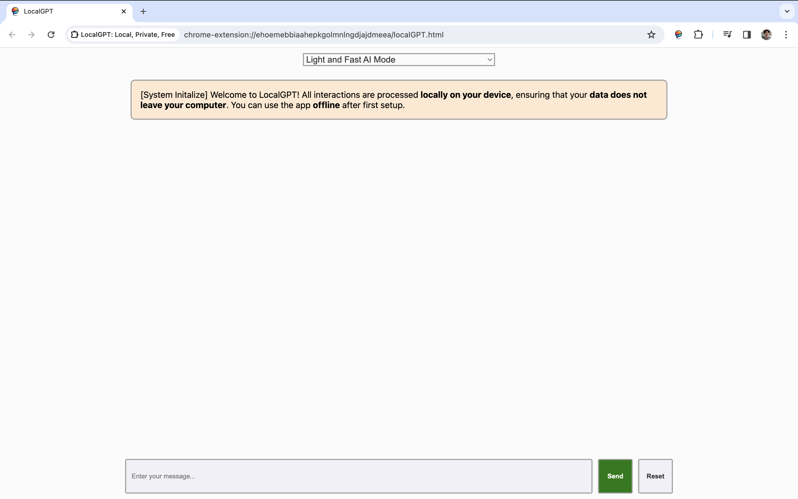

# LocalGPT: Local, Private, Free

LocalGPT is an open-source Chrome extension that brings the power of conversational AI directly to your local machine, ensuring privacy and data control. Unlike other services that require internet connectivity and data transfer to remote servers, LocalGPT runs entirely on your computer, ensuring that no data leaves your device (Offline feature is available after first setup). It's free to use and leverages the capabilities of [WebLLM](https://github.com/mlc-ai/web-llm) to offer a seamless chatting experience using WebGPU.

[WebLLM](https://github.com/mlc-ai/web-llm) by [MLC.AI](https://mlc.ai/) is the biggest contributor that provides the infrastructure and most of the UI.




## Features

- **Two Modes for Different Needs**: Choose between "Light and Fast AI Mode"  (based on TinyLlama-1.1B-Chat-v0.4)  for a quicker response time with lower resource usage, and "Smart and Heavy AI Mode" (based on Mistral-7B-Instruct-v0.2/) for more in-depth responses at the cost of higher resource usage.
- **Privacy-Centric**: Since LocalGPT runs locally, all data remains on your computer, ensuring a private conversational experience without the fear of data leaks or privacy breaches.
- **Open Source**: The entire codebase is open for review, contributions, and modifications, fostering a community-driven project that values transparency and user empowerment.
- **Offline Capability**: Being a local solution, it doesn't require an internet connection to function, making it ideal for offline use cases.

## Getting Started

### Prerequisites

Ensure you have [Node.js](https://nodejs.org/) installed on your computer to build and run the extension.

### Installation

1. Clone the repository or download the source code to your local machine.
2. Open a terminal and navigate to the root directory of the project.
3. Install the necessary dependencies by running:

To run the extension, do the following steps under this folder

```bash
npm install
npm run build
```

This will create a new directory at `localGPT/dist/`. To load the extension into Chrome, go to Extensions > Manage Extensions and select Load Unpacked. Add the `localGPT/dist/` directory. You can now pin the extension to your toolbar and use it to chat using your favorite mode!
